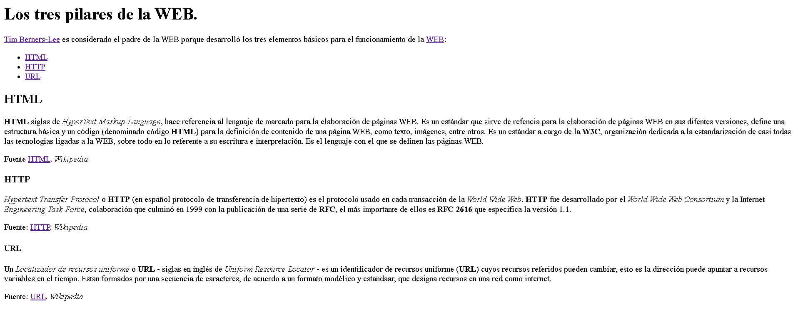

# Enunciado

A partir de la siguiente imagen, debes crear un documento HTML.

## Palabras con hipervinculo.

`Tim Berners-Lee` → *http://es.wikipedia.org/wiki/Tim_Berners-Lee*.

 

`WEB`→ *http://es.wikipedia.org/wiki/World_Wide_Web*.

 

`HTML`→ *http://es.wikipedia.org/wiki/HTML*.

 

`HTTP`→ *http://es.wikipedia.org/wiki/Hypertext_Transfer_Protocol*.

 

`URL`→ *http://es.wikipedia.org/wiki/Localizador_de_recursos_uniforme*.

## Video ilustrativo.

<video src="Videos/video1.mp4" controls="">

